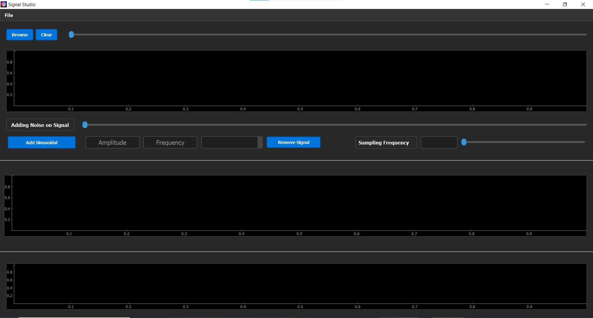
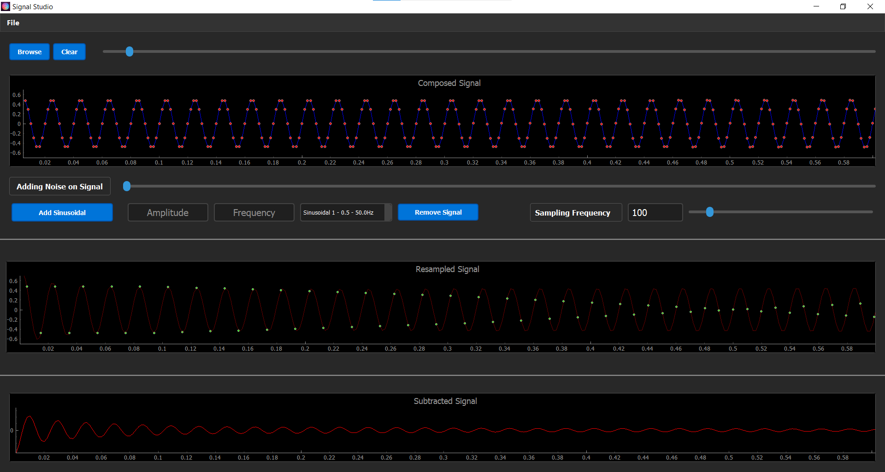

# Sampling Theory Studio

## Overview

The Sampling theory studio is a desktop application designed to illustrates the signal sampling and recovery of biological signals. Utilizing PyQt5 for its GUI and incorporating functionalities such as playback and real-time updates, it serves as a versatile tool for researchers and professionals working with biological signals like ECG.


<br>

## Features

- **Sample/Recover:** Visualize the signal, sample it at different frequencies, and then recover the original signal in a clean and user-friendly interface.
- **File Import:** Import signal data from `.dat` or `.csv` files.
- **Graphs:** Provide three graphs.
- **Load/Compose:** Add multiple sinusoidal signals with different frequencies and magnitudes. It also enables users to remove individual components while preparing the mixed signal.
- **Additive Noise:** Introduce noise to the loaded signal with a custom and controllable Signal-to-Noise Ratio (SNR) level..
- **Real-time Processing:** Sampling and recovery are performed in real-time in response to user changes.
- **Sampling Scenarios:** provide different scenarios for signal sampling.
- <br>

<br>
<br>

  
## Getting Started

### Prerequisites

- Python 3.x
- wfdb
- numpy
- pandas
- PyQt5
- pyqtgraph
- reportlab
- pyqt5-tools


### Installation

1. **Clone the Repository**

   ```shell
   git clone [https://github.com/fadymohsen/Sampling-Theory-Studio]
   cd [Sampling-Theory-Studio]
   ```

2. **Install Dependencies & Requirements**

   ```shell
   pip install -r requirements.txt #All Libraries & Packages
   ```

3. **Run the Application**

   ```shell
   python main.py
   ```

## How to Use

1. **Load Signal:**
    - Click on `Browse` and choose your signal file (.dat format).
    - View the signal in the respective channel panel.
  
2. **Remove Noise:**
    - Use the `Remove Noise` button to remove the noise from the mixed signal.
  
3. **Add Noise:**
    - Use the `Add Noise` button to add noise with controlable (SNR) level.
  
4. **Add Sinusoidal:**
    - Use the `Add Sinusoidal` button to add sinusoidal with custom frequence and amplitude.
  
5. **Clear:**
    - Click the `Clear` button to end the signal visualization in first and second channel.

6. **Zoom:**
   - Zoom in or out in the signal view.

## Development

### Structure

- **Sampling Theory Studio:** The primary GUI application class responsible for handling user inputs and managing UI updates.
- **Signal:** A class dedicated to managing and manipulating signal data, rendering, and controlling playback.

### Libraries

- **PyQt5:** Handles GUI creation, management, and user interaction.
- **pyqtgraph:** Enables real-time signal graphing.
- **wfdb:** Used for loading, writing, and processing WFDB signals and annotations.
- **NumPy and pandas:** Manage numerical operations and data management.
---

## Team Members: <br>
1- Fady Mohsen <br>
2- Ahmad Mahmoud <br>
3- Shehab Mohamad <br>
4- Mohamad Aziz <br>
